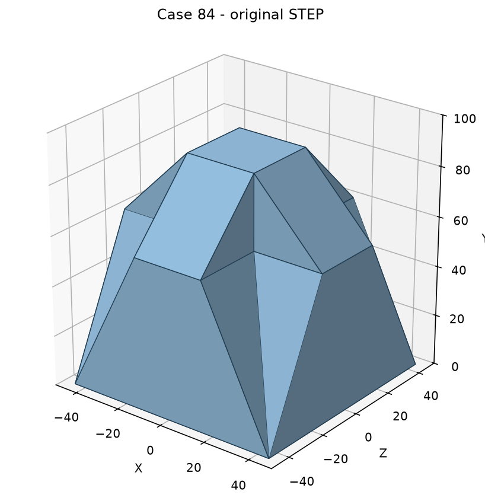

# Case 84：矩形—十字形—矩形的分面过渡实体

本例来自已收集的 T1 Case 84 原始 CAD，作为首个 **development_ready** 案例。它不是平板孔合成示例。单实体包含 26 个平面；原生建模包含拉伸、放样和切除，评分按最终两段分面过渡结构归一化，不要求复现历史操作顺序。

交付与审查由 [issue #3](https://github.com/sunzhenchuan007/benchcad-3d2d/issues/3) 跟踪，框架先行 PR 为 #2。



## 模型输入与 GT

模型仅获得 `input/model.step`，其字节与原始 STEP 相同。`gt/`、`sources/`、本说明和案例清单不提供给被测模型。

GT 含六个连续参数：底部 X/Z 宽度分别 90/90 mm，颈部 X/Z 宽度分别 30/30 mm，下段高 60 mm，上段高 30 mm。底面 Y=0，X/Z 居中，+Y 朝顶面；总高 90 mm 是两段高度之和。六个变量分别保留，不能因这件零件的两向宽度恰好相等而替图纸加入等值约束。

此外检查下段“矩形到十字形”、上段“十字形到矩形”的分面结构，以及 X/Z 居中关系。固定的连接拓扑与六个尺寸共同定义该参数化；不宣称适用于任意放样件或找到了唯一正确的特征拆分。

- `gt/native_features.json`：SOLIDWORKS 31.5.0 的只读原生特征和显示尺寸记录，SystemValue 从米转换为毫米。
- `gt/native_export.step`：从所选原生文件独立导出的最终实体，仅作后台配对核验。
- `gt/reconstruction.py`：有意义的六参数 CQ 分面重建，不导入 STEP；连接拓扑经过最终几何检查。
- `gt/gt.json`：最终特征、参数、结构要求及受控三视图的几何绑定。
- `gt/validation.json`：源哈希、重建核验、当前受控图纸对照结果及未校准状态。

所选原生源为 `sources/放样多凸台2023.SLDPRT`；另一个 SLDPRT 版本完整保留，但不据此宣称两个原生版本已核验等价。原生显示尺寸记录不是通用自动特征语义提取器；本例的归一化由开发者审核后固定，并通过独立实体重建检查。

## 验证与制图范围

源 STEP、原生独立导出和 CQ 重建均为有效单实体，26 面均为平面。原生导出及 CQ 重建与输入的**双向布尔差体积均为 0 mm³**，容差为 1e-5 mm³。

本例全部结构为外部可见分面，使用三个受控正投影视图，不要求剖切线。投影由 OCP 隐线算法生成，记录实际可见与隐藏边。六个尺寸及明确的结构说明必须实际绘出；后台真值、JSON 声明或按图量线不能替代它们。控件绑定表是后台开发适配器的证据缓存，不提供给被测模型。

```sh
python tools/verify_sources.py
python tools/verify_case84_geometry.py
```

第二条命令需要已有 CadQuery 与 ezdxf 环境，重新计算几何差异、核对存储 GT，并生成 12 组实际 DXF/JSON 对照到 `.outputs/case_084_recheck/`，不改写正式 GT。不在案例目录保存配套标准工程图。

正确图和“总高+下段高度”的等价图均得开发分数 100；额外标总高的重复图得 99.2857。矛盾、缺失、组合缺陷、JSON 独有尺寸、缺结构说明、缺视图、错误轮廓和文字遮挡均不通过。完整结果记录在 validation 中，**不是模型成绩**。

development_ready 仅表示原生配对、审计参数化与当前受控适配器可复跑。任意 DXF 表示、等价特征归一化、专家制图规则校准、PDF 评分及独立模型评测仍未完成，不能用于正式排行榜。
