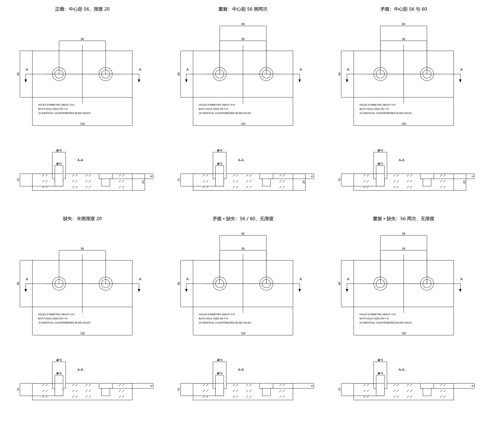

# 平板阶梯盲孔：制图与评分演示

这是人为构造的入门示例，**不进入 `cases/` 或案例注册表，不计入 benchmark 案例数量**。它用于解释 GT、实际图纸证据、等价尺寸链、重复、矛盾、缺失及遮挡扣分。

零件是 120×56×20 mm 平板，两个阶梯盲孔中心距 56 mm；沉孔 Ø16 深 6 mm，小孔 Ø10 总深 15 mm。沉孔与小孔直径集中标在下方剖视图，俯视图绘出 A-A 剖切线、箭头与标记。

本目录保存可直接重开的 STEP、正确 DXF、对应 prediction 和演示 GT。这里的 GT 可以公开阅读；真实评测时模型仍只接收 STEP，不接收 GT 或原生建模来源。



对照图从实际 DXF 渲染，包含正确、重复、矛盾、缺失、矛盾+缺失、重复+缺失。评分采用 development-v0.2 规则，尚未校准。

```sh
python -m benchcad3d2d verify --gt examples/plate_holes/gt.json --prediction examples/plate_holes/prediction.json --drawing examples/plate_holes/drawing.dxf --mode controlled-dxf
```

正确图应返回 pass、开发分数 100；这只是脚本生成样例的验证，不是模型作答成绩。

在已有 CadQuery、ezdxf 环境中执行 `python tools/build_controlled_demo.py` 可重新生成模型、GT 及 25 组缺陷提交到 `.outputs/controlled_c002/`。`python tools/render_controlled_review.py` 可重绘对照图。这里保存的静态样例是当前生成器的一份快照；更新时须重新核验 DXF 与 JSON 的对应关系。
